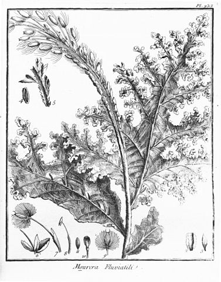

podostemaceous
==============

A python module for computing some characteristics of Direct Simulation Monte Carlo (DSMC) simulations and the particles in them.

`Podostemaceae <https://en.wikipedia.org/wiki/Podostemaceae>`_ is a family of river weeds.

Allows generation of VHS or VSS models from transport data (viscosity and/or self-diffusion as a function of temperature).

Allows estimates of errors in computed transport properties due to Δx, Δt, and N_c.
